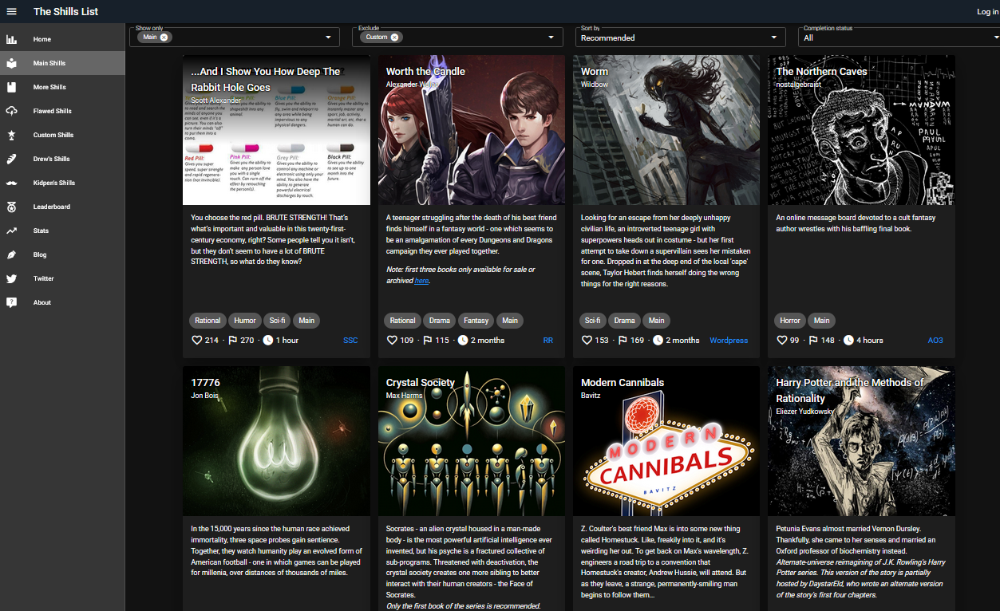

# The Shills List

[](https://github.com/recordcrash/the-shills-list/actions/workflows/main.yml)   



This is the internet fiction recommendations site currently hosted at https://recordcrash.com, built primarily using Vue 2. Right now it needs a connection to a custom express server hosted in the same VPS, but that might change in the future.

## Installation

To get started with this project, follow these steps:
1. Clone the repository:
   ```bash
   git clone https://github.com/recordcrash/shills.git
   cd shills
   ```
2. Install dependencies:

    ```bash
    yarn install
    ```
3. Start the dev server:

    ```bash
    yarn serve
    ```
4. Open your browser and navigate to `http://localhost:8080`.

# License
This project is licensed under the MIT License. You can pretty much do everything with the code except remove the credit.
